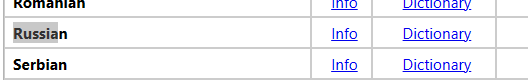

# Устанавливаем славянскую грамматику в Rider

1. Заходим на сайт [WinEdt Unicode Dictionaries](https://www.winedt.org/dict.html).
2. Качаем пак 
    
    
    
3. Распаковываем в папку с райдером файлы типа `dic`(можно и в другую папку)
    
    
    
    Если их там будет больше или меньше, то пофиг: просто перекинь все `dic` файлы
    
4. Открываем настройки(CTRL + ALT+ S или как на картинке) 
    
    
    
5. Находим раздел Spelling по ключевому слову в поисковой строке
    
    
    
6. Нажимаем на плюсик и указываем все `dic` файлы. После этого Save и перезагрузи райдер. Если после этого все равно не заработало, снова зайди в этот раздел и прожми Save.
